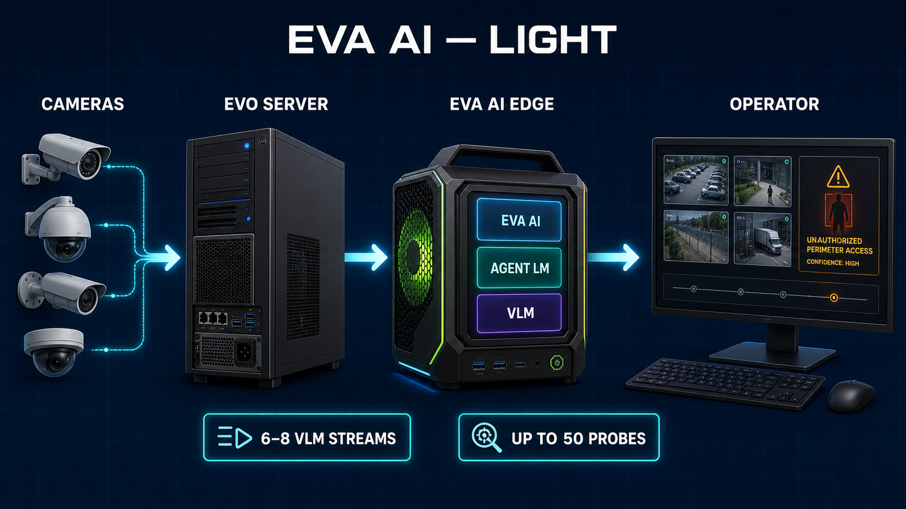
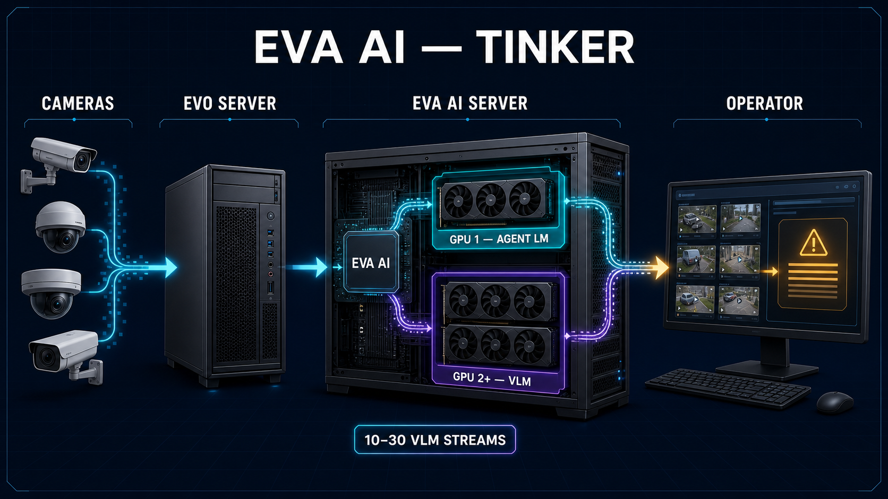
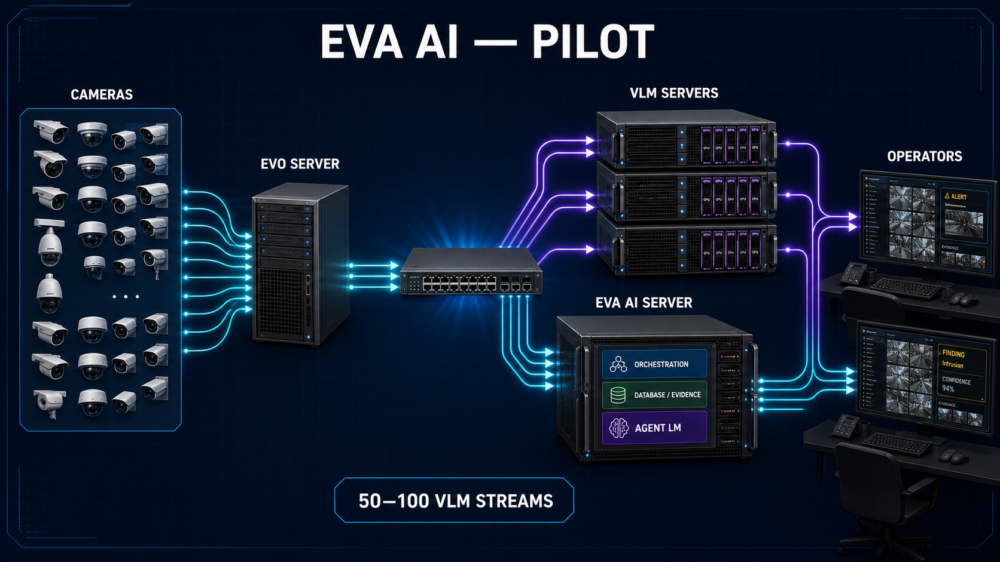

# EVA AI Deployment Profiles — Discussion Draft

Status: sizing hypothesis for solution-design discussion, not a contractual
capacity guarantee. Capacity must be accepted on the exact camera mix, model,
resolution, capture cadence, batch size, inference runtime, and thermal limits.

In every profile, the existing **Luxriot Evo server remains a separate physical
workstation** and is not included in the EVA AI hardware bill of materials.

## Executive comparison

| Profile | EVA AI compute | Inference placement | Planning envelope | Readiness |
|---|---|---|---|---|
| Light | 1 compact node | Agent + VLM share one GPU/unified-memory device | 6–8 VLM channels; up to 50 probes | x86 can be qualified now; DGX Spark needs an arm64 release |
| Tinker | 1 expandable workstation | Dedicated Agent GPU + 1–2 dedicated VLM GPUs | 10–30 VLM channels, hardware-dependent | Provisional until the purchased GPU mix passes soak testing |
| Pilot | 1 EVA AI/Agent server + 2 VLM servers | Agent is separate; 4 independent VLM GPUs/endpoints | 50 VLM channels with at least 15% measured headroom | Based on the Georgia field topology; must be re-qualified on 0.8.4 |

Power-supply figures below are system-design starting points, not vendor-derived
multi-GPU guarantees. The system integrator must validate the exact add-in-board
cards, cable topology, transient load, branch-circuit capacity, airflow, and
ambient temperature.

## What “channel capacity” means here

- A **VLM stream** is an active EVA video-description channel using a
  Qwen3-VL-4B-class model and a bounded multi-image batch.
- A **probe** is a lighter CLIP/CV watch workload. “Up to 50 probes” does not
  mean 50 simultaneous full-rate VLM streams.
- The target operating point keeps at least **15% inference headroom** for
  bursts, operator activity, retries, model warm-up, and uneven static channel
  routing.
- Recommended baseline: 1 FPS capture into EVA, 12-image VLM batches, and a
  30–60 second effective description cycle unless a site acceptance test proves
  a denser profile.

---

## 1. EVA AI Light

### Intended envelope

- 6–8 active VLM description channels.
- Up to 50 configured probes across the available camera inventory.
- EVA AI application, PostgreSQL, CLIP/probes, Agent LM, and VLM on one compact
  device.
- One operator or a small local operator group.

### Option A — compact AI appliance

| Component | Proposed specification |
|---|---|
| EVA AI node | NVIDIA DGX Spark or an OEM GB10 equivalent |
| CPU/GPU | Grace Blackwell GB10, integrated 20-core Arm CPU + Blackwell GPU |
| Memory | 128 GB coherent unified LPDDR5x |
| Storage | 4 TB NVMe |
| Network | 10 GbE RJ-45; ConnectX available but not required for this profile |
| Power | Included 240 W supply |
| Agent | Qwen3.5-9B-class quantized model, 65,536-token served context |
| VLM | Qwen3-VL-4B-class FP8/quantized model |
| Placement | EVA AI + Agent LM + VLM share the same GB10 device; admission control prevents operator questions and VLM bursts from exhausting the device simultaneously |

**Engineering gate:** DGX Spark is Arm-based. The current EVA AI r4 offline
bundle is amd64-specific, including its FFmpeg/OpenCV rescue payload. Light on
Spark therefore requires a separate arm64 bundle, dependency audit, media
runtime build, and a full live-camera acceptance run.

### Option B — deploy-now x86 workstation

| Component | Proposed specification |
|---|---|
| CPU | 16-core Ryzen 9 / Core Ultra workstation-class CPU |
| GPU | 1 × RTX 5090 32 GB; a 48 GB+ professional CUDA GPU is the lower-risk alternative |
| RAM | 128 GB DDR5 |
| Storage | 2 TB OS/application NVMe + 4 TB evidence/model NVMe |
| Network | 10 GbE |
| PSU | 1,200 W ATX 3.1, 230 V preferred, with native GPU power cable |
| Chassis | High-airflow workstation with unobstructed GPU intake and serviceable dust filtration |
| Placement | Agent and VLM share the GPU under admission control; EVA AI, PostgreSQL, CLIP, and archive remain local |

A single 16 GB RTX 5080 can be used only as a cost-down experiment with strict
quantization and concurrency limits. It does not provide comfortable memory
headroom for a 65k-context agent and a resident VLM together.

### Acceptance gate

- 8 channels for 8 hours, then 24-hour soak at the intended cadence.
- No VLM queue growth over a closed 30-minute window.
- Agent first response remains interactive during a full VLM batch burst.
- P95 description cycle ≤ 60 seconds; no sustained GPU thermal throttling.
- 50-probe test reports bounded latency and memory rather than silently dropping
  probe frames.

---

## 2. EVA AI Tinker

### Intended envelope

- 10–30 active VLM description channels, depending on the number and class of
  VLM GPUs.
- Agent and VLM inference are physically separated by GPU inside one EVA AI
  workstation.
- Intended for a technical operator who is comfortable tuning power limits,
  inference concurrency, and channel assignment.

### Base two-GPU build

| Component | Proposed specification |
|---|---|
| CPU/platform | Ryzen 9-class board with a vendor-validated x8/x8 GPU layout, or entry TRX50 |
| GPU 1 — Agent/CLIP | RTX 5060 Ti **16 GB** |
| GPU 2 — VLM | RTX 5080 16 GB; RTX 5070 Ti 16 GB is the cost-down option |
| RAM | 128 GB DDR5; ECC preferred where the platform supports it |
| Storage | 2 TB OS/application NVMe + 4–8 TB model/evidence NVMe |
| Network | 10 GbE |
| PSU | 1,200 W ATX 3.1 minimum for 5060 Ti + 5080, with native Gen 5 GPU cables |
| Target | Approximately 10–16 VLM streams pending acceptance on the exact model/cadence |

### Recommended three-GPU build

| Component | Proposed specification |
|---|---|
| CPU/platform | Threadripper 9960X/7960X-class CPU on TRX50; use WRX90/Threadripper PRO when full x16 lanes, ECC capacity, or future fourth-GPU expansion matters |
| GPU 1 — Agent/CLIP | RTX 5060 Ti 16 GB |
| GPU 2–3 — VLM | 2 × RTX 5070 Ti 16 GB, or 2 × RTX 5080 16 GB |
| RAM | 256 GB ECC RDIMM recommended |
| Storage | 2 TB mirrored OS/application NVMe + 8 TB evidence/model NVMe |
| Network | 10 GbE minimum; 25 GbE optional for future node separation |
| PSU | 1,600 W high-quality 230 V supply or workstation dual-PSU design; validate transient load and connector temperature |
| Chassis | Full tower / 4U high-airflow chassis with physical spacing between open-air GeForce cards |
| Target, 2 × 5070 Ti | Approximately 16–24 VLM streams, provisional |
| Target, 2 × 5080 | Approximately 20–30 VLM streams, provisional |

Run one VLM endpoint per VLM GPU and route channels statically across those
profiles. Do not use tensor parallelism for the 4B VLM when one model instance
fits on one GPU; independent endpoints preserve concurrency and fault isolation.

The plain RTX 5070 has 12 GB VRAM. It is acceptable for experiments but is not
the preferred purchase for this profile: the RTX 5060 Ti 16 GB, RTX 5070 Ti
16 GB, and RTX 5080 16 GB give a safer model/KV/cache envelope.

### Acceptance gate

- Soak the purchased configuration at 70%, 85%, and 100% of the proposed
  channel count.
- Keep the accepted production count at or below the point that leaves 15%
  measured inference headroom.
- Agent latency is measured while every VLM GPU is busy.
- A stopped VLM endpoint must surface degraded coverage; current static routing
  is not automatic failover.
- Validate wall power, GPU hotspot temperature, connector temperature, and
  acoustic/thermal behavior for at least 8 hours.

---

## 3. EVA AI Pilot — Georgia Reference Profile

### Intended envelope

- 50 accepted VLM description channels.
- At least 15% reserved operational inference headroom.
- Separate EVA AI control-plane/agent server and two dedicated VLM servers.
- Separate existing Luxriot Evo workstation.

### Observed field reference

The June 2026 Georgia installation used two VLM servers with two RTX 5080 GPUs
per server: four independent Qwen3-VL-4B-Instruct-FP8 endpoints in total. At 50
channels, 1 FPS capture, and an approximately 30-second effective cycle, the
four GPUs were observed around 70% load. This is useful field evidence, not a
portable guarantee.

### EVA AI control-plane and Agent server

| Component | Proposed specification |
|---|---|
| CPU | 16–24 modern high-clock x86 cores |
| Agent/CLIP GPU | RTX 4070/5070 class is viable after measurement; prefer RTX 4070 Ti SUPER or RTX 5070 Ti **16 GB** for a 65k agent context and CLIP headroom |
| RAM | 128 GB ECC preferred |
| OS/application | 2 × 2 TB NVMe mirror |
| PostgreSQL/evidence | 8 TB enterprise NVMe usable capacity, plus independent backup target; final size follows retention policy |
| Network | Dual 10 GbE recommended: camera/Evo network and inference/management network |
| PSU | 1,000–1,200 W high-quality redundant or workstation supply, matched to the selected GPU |
| Services | EVA AI web/API, PostgreSQL, auth/RBAC, audit, archive, CLIP/probes, Agent LM endpoint |

Plain 12 GB RTX 4070/5070 cards should not be specified blindly for the agent:
the Qwen3.5-9B quantization, actual 65,536-token KV allocation, CLIP residency,
and concurrent operator workload must fit with measured VRAM margin.

### VLM server A and VLM server B — identical

| Component | Per-server specification |
|---|---|
| Chassis/platform | AI workstation/server chassis validated for two full-length dual-slot GPUs at PCIe x8 or better each; do not assume a compact Ryzen AI Max platform exposes suitable lanes/slots |
| CPU | 16+ x86 cores; inference is GPU-bound, but decode, request handling, and two vLLM services need CPU margin |
| GPUs | 2 × RTX 5080 16 GB |
| RAM | 128 GB ECC preferred |
| Storage | 2 TB OS/venv NVMe + 2–4 TB model/cache NVMe |
| Network | 10 GbE minimum |
| PSU | 1,600 W, 230 V, with independently cabled native GPU connectors; redundant server PSU design preferred |
| Cooling | Front-to-back high-airflow 4U or validated workstation chassis; avoid adjacent recirculating open-air cards |
| Runtime | One vLLM service per GPU, four endpoints across both hosts |
| Model | Qwen/Qwen3-VL-4B-Instruct-FP8 |
| Known-good baseline | `max_model_len=8192`, `gpu_memory_utilization=0.82`, `max_num_seqs=4`, `limit_mm_per_prompt.image=16` |

### Capacity and headroom statement

Use the commercial statement **“50 VLM channels with 15% reserved operational
headroom at the accepted pilot cadence.”** Do not translate this into a promise
of 57 or 60 channels without another soak test. The observed 70% average load
suggests additional room, but static routing, burst synchronization, thermals,
camera decode behavior, and tail latency are nonlinear.

EVA AI 0.8.4 also changes capture selection and backpressure behavior relative
to the fielded 0.8.1 build. Re-run the 50-channel acceptance test before treating
the old utilization figure as the new steady state.

### Acceptance gate

- 24-hour burn-in, followed by a 48-hour 50-channel soak.
- P95 and P99 end-to-end description-cycle latency recorded per endpoint.
- No monotonic queue growth, silent coverage gaps, or repeated OOM restart.
- Agent report and archive query remain responsive during peak VLM load.
- Pull one VLM endpoint: affected channels must be visibly degraded and manually
  reassignable; spare compute is not the same as automatic high availability.
- Confirm evidence-storage growth and retention against real camera imagery.

---

## Hardware facts used in this draft

- NVIDIA DGX Spark: 128 GB unified LPDDR5x, 273 GB/s, 4 TB NVMe, 10 GbE,
  240 W supply, Arm-based GB10 platform.
- RTX 5060 Ti: choose the 16 GB variant; 180 W reference total graphics power.
- RTX 5070: 12 GB; RTX 5070 Ti: 16 GB and 300 W.
- RTX 5080: 16 GB and 360 W.
- RTX 5090: 32 GB and 575 W.
- AMD TRX50 exposes workstation-class PCIe expansion; WRX90/Threadripper PRO is
  the safer platform for dense multi-GPU and full-lane expansion.

Primary vendor references:

- <https://docs.nvidia.com/dgx/dgx-spark/hardware.html>
- <https://www.nvidia.com/en-us/geforce/graphics-cards/50-series/rtx-5060-family/>
- <https://www.nvidia.com/en-us/geforce/graphics-cards/50-series/rtx-5070-family/>
- <https://www.nvidia.com/en-us/geforce/graphics-cards/50-series/rtx-5080/>
- <https://www.nvidia.com/en-us/geforce/graphics-cards/50-series/rtx-5090/>
- <https://www.amd.com/en/products/processors/workstations/ryzen-threadripper.html>

Field reference:

- `readiness/history/PILOT_INSTALLATION_RECORD_2026-06.md`
- `readiness/VLLM_QWEN3_VL_INFERENCE_SERVER_RUNBOOK.md`

## Decisions required before procurement

1. **Light architecture:** fund an arm64 EVA AI bundle and Spark qualification,
   or standardize the first Light units on the deployable x86/RTX design.
2. **Tinker target:** choose the commercial channel tier first, then choose one
   or two VLM GPUs. Do not sell the upper end of the 10–30 range for the base
   two-GPU build.
3. **Pilot platform identity:** record the exact make/model, motherboard, slots,
   PSU, and cooling of the “AI Max” VLM hosts. The name alone is insufficient
   to approve two RTX 5080 cards.
4. **Agent GPU:** measure the selected Qwen3.5-9B quantization at a served 65,536
   token context with CLIP and realistic concurrent requests before approving a
   12 GB card; prefer 16 GB when procurement permits.
5. **Capacity evidence:** re-run the 0.8.4 soak matrix and retain utilization,
   queue-depth, latency, thermals, and error-rate results as the capacity record.
