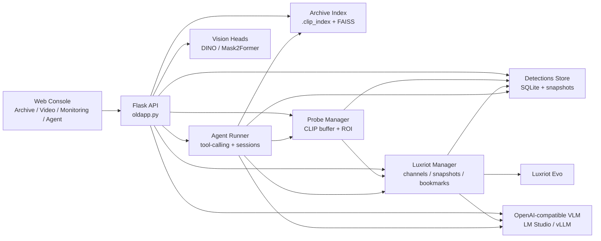
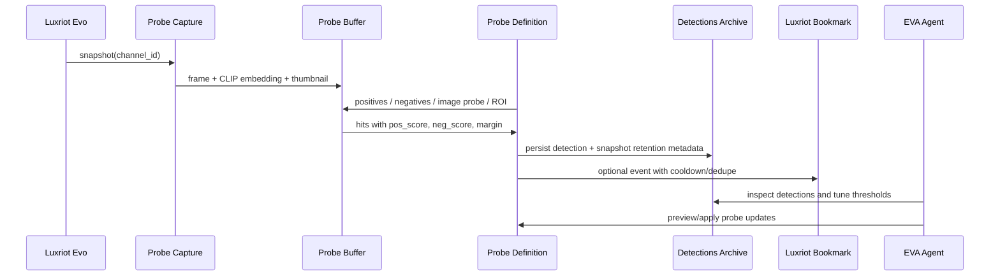
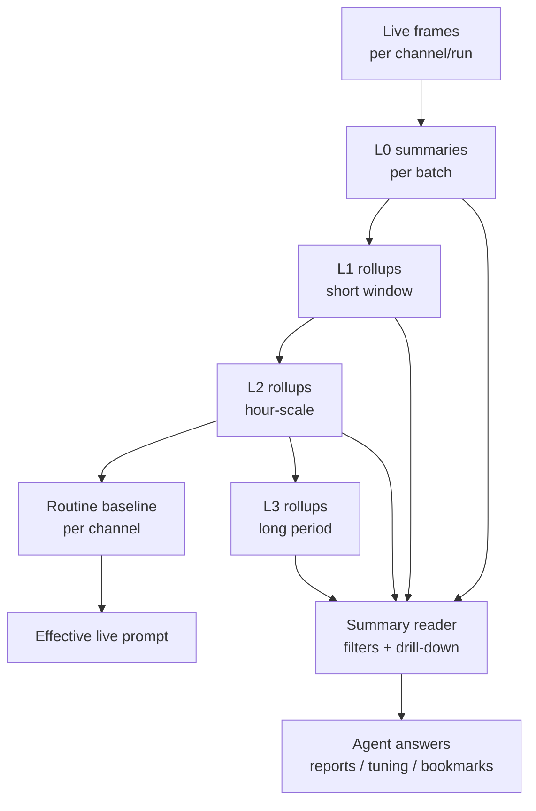
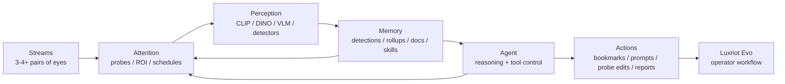

# EVA AI: инженерное описание, возможности и вектор развития

Документ описывает Luxriot EVA AI как инженерный продукт: что уже собрано в проекте, на каких технологиях это держится, как объяснять систему внешней аудитории без рекламного шума и куда логично развивать архитектуру дальше.

## Короткое описание

Luxriot EVA AI - это AI-слой поверх Luxriot Evo для семантического поиска, понимания видео, активного мониторинга и операторского агента. Система объединяет архив изображений, живые камеры, настраиваемые пробы, VLM-сводки, bookmarks и чат-агента в один рабочий контур: оператор не переключается между отдельным поиском, отдельной аналитикой и отдельным ассистентом, а управляет вниманием системы через один интерфейс.

В текущем состоянии это alpha PoC, но уже с end-to-end рабочими сценариями: индексирование архива, поиск по тексту и изображению, live-захват Luxriot-каналов, пробы по позитивным/негативным описаниям, ROI, сохранение детекций, адаптивная дедупликация кадров, многоуровневые видео-сводки, bookmarks в Luxriot и агент с tool-calling.

## Продуктовая формула

EVA AI не пытается быть еще одним изолированным модулем "детекции", "видеосводок" или "чат-бота". Стратегический вектор другой:

- видео - это голова с несколькими парами глаз, способная переключаться между потоками;
- пробы - это управляемое внимание: что искать, где смотреть, когда реагировать;
- архив - это зрительная память: не просто файлы, а семантически найденные события;
- rollups и markdown/playbooks - это долговременная рабочая память;
- агент - это управляющий слой: настраивает пробы, промпты, сценарии, отчеты и взаимодействие с оператором;
- Luxriot Evo - это операционная среда, куда возвращаются события, bookmarks и, в будущем, общие данные.

## Возможности Сейчас

### 1. Archive Research

Архивный поиск работает как рабочая зона расследования:

- индексирование папок изображений в локальные `.clip_index`;
- поиск по тексту через CLIP/SigLIP-подобные embedding-модели;
- поиск по изображению и "find similar";
- режимы `CLIP`, `DINO` и `fusion`, если включены соответствующие индексы;
- поиск не только по исходным папкам, но и по `Detections Archive`;
- сортировка по similarity или времени;
- комментарии к изображениям;
- интерактивная сегментация/поиск по области через DINO segments и Mask2Former refinement;
- описание изображения через OpenAI-compatible VLM.

Инженерная ценность: оператор может начинать с естественного языка, переходить к визуальному сходству, уточнять область интереса и сохранять выводы прямо в контексте архива.

### 2. Video Understanding

Видео-слой уже покрывает два режима:

- offline video understanding через `/video_understanding` с выборкой кадров из файла;
- live Luxriot summaries по каналам, где кадры собираются батчами и отправляются в VLM.

Для live-режима реализованы:

- выбор канала, batch size, модели и промпта;
- видимый system prompt;
- запуск/остановка потоков;
- история summary entries, которая не пропадает после остановки;
- run IDs и фильтрация по run/time window;
- L0/L1/L2/L3 rollups;
- drill-down из старших уровней к исходным L0-сводкам;
- copy/export summaries;
- bookmarks из summary-алертов через Luxriot API;
- сохранение prompt settings и per-channel overrides.

Инженерная ценность: система не просто "посмотрела видео и ответила", а строит иерархическую память: сырые батчи, короткие окна, часовые окна, долгий контекст и routine baseline.

### 3. Monitoring + Probes

Пробы - главный слой активного внимания:

- сохраненные probe cards;
- позитивные и негативные текстовые пары;
- optional image probe;
- per-probe thresholds: `pos_floor`, `margin`, `top_k`, `window_sec`;
- severity и bookmark behavior;
- ROI: прямоугольная область внимания для конкретной пробы;
- фоновый probe daemon по активным каналам;
- capture loop через Luxriot snapshots;
- recent hits strip и ручной запуск пробы;
- SQLite persistence для детекций;
- adaptive retention, чтобы не засорять архив почти одинаковыми кадрами;
- Luxriot bookmarks с cooldown/dedupe gate;
- throughput benchmark `/probes/bench`.

Инженерная ценность: probe - это не жестко прошитый детектор, а настраиваемый semantic trigger. Он может искать сценарий вроде "человек в зоне ворот, но не сотрудник в форме", а не только класс `person`.

### 4. Detections Archive

События проб пишутся в SQLite и снапшоты на диск:

- `detections_store.sqlite3` хранит события, score, margin, severity, channel/probe metadata;
- `detections_archive/` хранит выбранные кадры;
- CLIP/DINO vectors могут сохраняться рядом с detection rows;
- shard keys помогают группировать события по channel/date;
- adaptive retention сохраняет якорные и отличающиеся кадры, а похожие кадры может пропускать или записывать без нового snapshot.

Инженерная ценность: это уже зачаток долговременной памяти наблюдения, которую можно искать, агрегировать и использовать для дообучения/тюнинга проб.

### 5. Agent

Агент в проекте не декоративный чат. Он имеет tool-calling контур и доступ к операционным функциям:

- semantic search по indexed folder и detections archive;
- чтение detection events и summary by probe;
- list channels / list probes;
- survey channels;
- build research batch для тюнинга;
- create/update/delete probes с preview-first безопасностью;
- describe frame по live snapshot, detection или image path;
- get/update prompt settings;
- get video summaries L0-L3;
- create Luxriot bookmark;
- generate report;
- session persistence в SQLite;
- SSE streaming, tool progress и heartbeat;
- локальные skills/playbooks в `skills/*.md`.

Сейчас skills уже задают рабочие протоколы: `archive_research`, `probe_tuning`, `prompt_tuning`, `protocol_deploy`. Это важный фундамент для будущей markdown-памяти.

## Технологический Стек

| Слой | Технологии | Роль |
| --- | --- | --- |
| Web/API | Flask, Jinja templates, static JS/CSS, SSE | единая операторская консоль |
| Embeddings | CLIP, SigLIP2-compatible HF path, DINOv3 | семантическое представление изображений/текста |
| Vector Search | FAISS `IndexFlatIP` | быстрый similarity search |
| Vision heads | Mask2Former, DINO heatmaps/segments | уточнение областей и сегментов |
| Video/VLM | OpenAI-compatible API, LM Studio/vLLM | описание кадров и rollup-сводки |
| Luxriot | HTTP Digest auth, `/channels`, `/live/{id}/snapshot`, `/createBookmark` | интеграция с Evo-каналами и событиями |
| Storage | SQLite, JSON stores, файловый архив | detections, agent sessions, probes, rollup cache |
| Runtime | Python threads, capture sessions, probe daemon | фоновые потоки обработки |
| Config | `.env`, `EVOSSEARCH_*`, settings UI | управляемые runtime-настройки |
| QA/Tools | unittest smoke tests, head harness, segment index tool | проверка API/security/dataflow и profiling heavy heads |

## Текущая Архитектура

## Поток Данных: Пробы Как Внимание

## Поток Данных: Видео-Память

## Стратегическая Схема

Ключевой смысл: агент не должен быть только чат-интерфейсом, а пробы не должны быть только набором независимых правил. Агент управляет вниманием, памятью и действиями. Пробы дают ему активные сенсоры. Видео дает поток восприятия. Архив и markdown-слой дают память.

## Сценарии Использования

| Сценарий | Как работает сейчас | Что усиливать дальше |
| --- | --- | --- |
| Ретроспективный поиск | текст/image search по папке или detections archive | единый временной индекс, более богатые фильтры, cross-camera correlation |
| Живой мониторинг | Luxriot capture + semantic probes + bookmarks | schedules, auto-prioritization, escalation policies |
| Настройка проб | ручные thresholds, ROI, agent `probe_tuning` skill | полуавтоматическое доучивание на false positive/false negative выборках |
| Видео-сводки | L0-L3 summaries, run/time filters, drill-down | persistent rollup DB, richer retrieval, routine drift detection |
| Развертывание сценариев | `protocol_deploy` skill: survey -> scenarios -> probes/prompts | curated scenario packs per site/domain |
| Отчеты | agent `generate_report` по detections | смешанные отчеты: detections + video summaries + operator notes |
| Интеграция с Evo | channels, snapshots, bookmarks | shared DB/event lifecycle, richer metadata, bidirectional state |

## Инженерно Честные Ограничения

- Проект сейчас alpha PoC, а не сертифицированная safety/security-система.
- DINO и Mask2Former требуют аккуратного GPU-профилирования; для слабых RTX лучше начинать с CLIP-only профиля.
- VLM-сводки зависят от качества локальной модели, промпта и sampling cadence.
- Текущие stores простые: SQLite/JSON/файлы. Этого достаточно для PoC и demo, но для продакшн-мультисайта потребуется миграция к более формальной схеме хранения.
- Пробы семантические, поэтому требуют калибровки на реальных камерах, а не только на красивых примерах.
- Bookmarks должны иметь gates/cooldowns, иначе операторский журнал быстро станет шумным.

## Вектор Развития

### Ближайший горизонт

1. Доучивание и тюнинг проб.
   - Собирать false positives / false negatives из detections archive.
   - Строить research batches по времени, score bands и каналам.
   - Давать агенту безопасный цикл: анализ -> preview diff -> подтвержденное изменение.
   - Хранить историю изменений пробы и post-change метрики.

2. Отладка поведения агента.
   - Улучшать tool loop, progress, ошибки и self-check перед мутациями.
   - Развести режимы: исследование, deployment, tuning, отчет, аварийное действие.
   - Добавить больше runtime skills для повторяемых операторских задач.

3. Сценарии и packs.
   - Наборы типовых проб: периметр, очередь, зона погрузки, оставленный объект, нештатное присутствие, рабочая зона, вход/выход.
   - Per-channel scenario templates после survey.
   - Явная связь сценарий -> probes -> prompts -> bookmarks -> отчет.

4. Расписания.
   - Временные окна активности проб.
   - Разные thresholds ночью/днем.
   - Планировщик VLM-сводок и rollups.
   - Maintenance/quiet hours, когда bookmarks не отправляются или отправляются с другой severity.

### Средний горизонт

1. DETR/YOLO как дополнительный слой.
   - Не замена semantic probes, а "жесткий" visual prior.
   - Детектор дает candidates/classes/tracks, CLIP/DINO уточняют смысл, VLM объясняет контекст, агент принимает решение о действии.
   - Хороший вариант для дешевых сигналов: person/vehicle/bag/helmet/PPE/door/open-area occupancy.

2. Глубже в Luxriot Evo.
   - Общие события и lifecycle: created, acknowledged, resolved.
   - Общая БД или синхронизация metadata.
   - Более богатые channel/site/zone mappings.
   - Operator feedback из Evo обратно в EVA AI: correct/incorrect/useful/noisy.

3. Markdown/wiki как память.
   - `docs/*.md`, `skills/*.md`, site runbooks и регламенты как отдельный retrieval layer.
   - Агент отвечает по документации и использует ее при настройке проб/промптов.
   - Markdown становится не просто документацией для разработчика, а процедурной памятью системы.

4. Persistent rollups.
   - Перенести rollup cache из JSON в полноценную DB-схему.
   - Индексировать summaries embeddings.
   - Позволить агенту отвечать "что изменилось за неделю" без повторного просмотра видео.

### Дальний горизонт

1. Multi-stream attention scheduler.
   - Агент сам решает, какие камеры смотреть чаще, где включать VLM, где достаточно дешевых probes.
   - Переключение "пар глаз" по событиям, расписанию, uncertainty и operator intent.

2. Evidence graph.
   - Связать detections, video summaries, bookmarks, probes, prompts, operator notes и документацию.
   - Ответы агента должны ссылаться на цепочку evidence, а не быть свободным пересказом.

3. Scenario lifecycle.
   - Создание сценария -> сбор baseline -> запуск probes -> калибровка -> отчет -> feedback -> новая версия.
   - Это превращает PoC в систему эксплуатационного обучения.

## Как Объяснять Проект Без Продажного Тона

### Одним абзацем

EVA AI - это инженерный AI-слой для Luxriot Evo, который соединяет семантический поиск по архиву, live-анализ камер, настраиваемые пробы и агента-оператора. Система видит поток, сохраняет важные моменты, строит сводки, ищет по памяти и помогает настраивать сценарии наблюдения через естественный язык, но с проверяемыми инструментами и явными thresholds.

### Для технической аудитории

Это Flask/Python приложение с FAISS-backed visual search, CLIP/SigLIP/DINO embeddings, Luxriot snapshot/bookmark integration, OpenAI-compatible VLM pipeline, SQLite event storage и tool-calling агентом. Архитектура строится вокруг единого контура: streams -> embeddings/summaries -> detections/rollups -> agent tools -> Luxriot actions. Heavy vision heads вроде Mask2Former изолированы и профилируются отдельно.

### Для оператора

Система помогает искать события по описанию, следить за выбранными сценариями на живых камерах, получать сводки по потокам и быстро создавать bookmarks. Важные настройки остаются явными: какие пробы включены, по каким каналам, с какими порогами, ROI и severity.

### Для интегратора

EVA AI можно начинать как PoC рядом с Luxriot Evo: читать каналы и snapshots, отправлять bookmarks, хранить свой event/archive слой, а затем постепенно углублять интеграцию в общие события, общие справочники каналов/зон и обратную связь от операторов.

## Маркетинговое Ядро Без Гипербол

- "Поиск, мониторинг и агент в одном контуре".
- "Пробы как управляемое внимание, а не набор жестких детекторов".
- "Видео-сводки превращаются в память, по которой можно спрашивать".
- "Операторские действия возвращаются в Luxriot Evo через bookmarks".
- "Markdown playbooks и skills превращают настройку системы в воспроизводимый процесс".

## Что Стоит Документировать Следующим

1. `docs/scenario_packs_ru.md` - типовые сценарии проб и промптов.
2. `docs/agent_playbooks_ru.md` - как агент должен вести deployment/tuning/reporting.
3. `docs/schedules_spec.md` - модель расписаний для проб, VLM и bookmarks.
4. `docs/evo_integration_plan.md` - уровни интеграции с Luxriot Evo от HTTP API до общей DB/event lifecycle.
5. `docs/md_memory_spec.md` - markdown/wiki retrieval layer для документации, регламентов и site knowledge.
