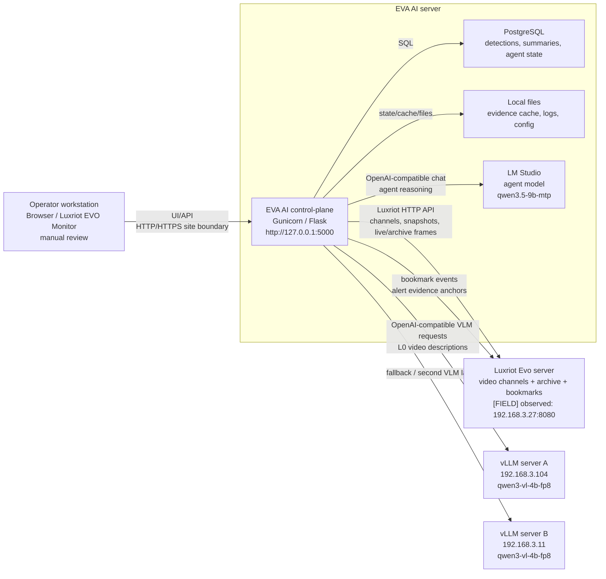

# EVA AI client physical topology - β 0.8.3

Purpose: give the engineer, PM, and operator a simple physical view of the
client pilot: where Luxriot Evo is, where EVA AI is, where the agent model is,
where VLM inference runs, and which main links must work.

This is not a full network security design and not an inventory of every port.
It is a working map for installation, troubleshooting, and client discussion.

SVG diagram for browser viewing or document insertion:
`readiness/CLIENT_PHYSICAL_TOPOLOGY_0.8.3.svg`.

## 1. Nodes

| Node | Role | Known parameters |
| --- | --- | --- |
| Luxriot Evo server | Video channels, archive, bookmarks | `[FIELD]`, observed pilot URL `http://192.168.3.27:8080` |
| EVA AI server | UI/API, agent tools, video-description runtime, Postgres, archive metadata | app dir `/opt/eva-ai/evo-ssearch`, service `eva-ai`, internal URL `http://127.0.0.1:5000` |
| LM Studio on EVA AI server | Agent LLM | `qwen3.5-9b-mtp` |
| vLLM server A | VLM inference | `192.168.3.104`, ports `8001` / `8002`, model `qwen3-vl-4b-fp8` |
| vLLM server B | VLM inference | `192.168.3.11`, ports `8001` / `8002`, model `qwen3-vl-4b-fp8` |
| Operator workstation / Luxriot EVO Monitor | UI access and manual verification | browser or EVO Monitor web tile |

## 2. Physical picture



## 3. Main data paths

### Live video-description path

```text
Luxriot Evo channels
  -> EVA AI capture loop
  -> L0 frame batch
  -> vLLM qwen3-vl-4b-fp8
  -> video description + ALERTS_JSON
  -> EVA AI summary store / archive evidence
  -> UI + agent tools
```

### Alert bookmark path

```text
VLM alert / backend state event
  -> EVA AI alert parser and delivery gate
  -> Luxriot bookmark API
  -> Evo archive bookmark visible to operator
```

Delivery status is tracked separately from detection:

```text
detected -> parsed -> sent | cooldown_skipped | bookmark_disabled | failed
```

### Agent path

```text
Operator chat
  -> EVA AI agent gateway and tools
  -> LM Studio qwen3.5-9b-mtp
  -> tool calls over EVA AI state/API
  -> answer with coverage/provenance
```

The agent should use probes as secondary semantic signals. The operator-facing
center is video descriptions, VLM alerts, coverage, and evidence.

### Road / drift candidate path

```text
Luxriot street channel
  -> EVA AI frame batch
  -> lightweight road CV / vector cues
  -> VLM attention cue
  -> VLM confirms/rejects against current frames
  -> candidate alert/evidence for human review
```

Road outputs are candidate/evidence signals. They are not legal conclusions.

## 4. What must be true after install

- EVA AI `/health` returns `β 0.8.3`.
- EVA AI can reach Luxriot Evo.
- EVA AI can reach LM Studio agent profile with `qwen3.5-9b-mtp`.
- EVA AI can reach VLM profiles on vLLM servers with `qwen3-vl-4b-fp8`.
- Disabled or stale Luxriot channel shows signal loss/frozen state, not replayed
  buffered video.
- VLM alerts have evidence or a clear reason why evidence is unavailable.

## 5. Quick failure map

| Symptom | Likely broken path |
| --- | --- |
| UI opens, but no channels | EVA AI -> Luxriot Evo channel API |
| live preview shows signal lost | Luxriot channel disabled/stale, capture endpoint unavailable, or auth/stream alias issue |
| summaries absent but preview works | EVA AI -> vLLM profile, model queue, or L0 prompt/runtime |
| agent answers but cannot inspect video | agent tool gateway or video-summary tools |
| bookmarks missing but alerts visible | EVA AI -> Luxriot bookmark API, cooldown, bookmark auth/gate |
| `/ready` model profile mismatch | `.env` / UI model settings / load-balancer routing |

