# EVA AI β 0.8.2.1 — аудит текущей схемы БД

Дата: 2026-06-30.

Область: текущая реализация ветки `feature/secure-50-channel-foundation`,
версия `β 0.8.2.1`, Alembic head `20260614_0006`.

Этот документ фиксирует только то, как схема и хранение данных устроены сейчас.
Варианты интеграции и предложения по переделке здесь намеренно не приводятся.

## Короткое резюме

- Текущий runtime рассчитан на PostgreSQL; archive backend в коде нормализуется
  в `postgres`.
- Рабочие домены данных: `iam`, `agent`, `audit`, `jobs`, `archive`.
- Изоляция tenant-данных сделана через `tenant_id` и RLS. Runtime выставляет
  `eva.tenant_id` в контексте транзакции.
- Чаты агента, tool runs, preview/apply plans и receipts живут в `agent`.
- Security/admin/tool audit живёт в append-only `audit.events`.
- Очередные таблицы `jobs` присутствуют в схеме как durable foundation для
  inference jobs/outbox.
- Видеоописания не имеют отдельной нормализованной таблицы. Их история,
  настройки промптов, run-метаданные и memory/state хранятся JSON-состоянием в
  `archive.runtime_state`.
- Поисковые/evidence-кадры от проб, L0 summary и L0 alerts лежат в одной таблице
  `archive.detections` и различаются через `source`.
- Всё, что связано с хранением картинок/скриншотов, отдельно помечено ниже
  маркерами `[IMAGE_DB]`, `[IMAGE_REF]`, `[IMAGE_CONFIG]`, `[IMAGE_FILE]`.

## Версия схемы

Текущая ожидаемая ревизия задана в [eva_db/settings.py](/home/sasha/Projects/evo-ssearch/eva_db/settings.py:17):
`CURRENT_SCHEMA_REVISION = "20260614_0006"`.

Миграции:

| Revision | Содержание |
| --- | --- |
| `20260609_0001` | Secure PostgreSQL foundation: `iam`, `agent`, `audit`, `jobs`, RLS, runtime roles |
| `20260609_0002` | Grants для API-side inference admission и Alembic visibility |
| `20260609_0003` | Durable agent approvals: hash checks, active approval uniqueness, indexes |
| `20260610_0004` | `iam.login_attempts` для durable login throttling |
| `20260612_0005` | `archive`: detections, probes, runtime_state |
| `20260614_0006` | `iam.users.all_channel_access` |

Runtime roles:

- `eva_owner`
- `eva_migrator`
- `eva_api`
- `eva_worker`
- `eva_agent_reader`
- `eva_audit_writer`
- `eva_backup`

## Tenant/RLS

Все tenant-bound таблицы имеют `tenant_id`. На них включены:

- `ENABLE ROW LEVEL SECURITY`
- `FORCE ROW LEVEL SECURITY`
- policy вида `tenant_id = NULLIF(current_setting('eva.tenant_id', true), '')::uuid`

Tenant-bound таблицы:

- `iam.users`
- `iam.sessions`
- `iam.roles`
- `iam.user_roles`
- `iam.role_permissions`
- `iam.user_channel_grants`
- `iam.login_attempts`
- `agent.sessions`
- `agent.messages`
- `agent.tool_runs`
- `agent.action_plans`
- `agent.action_approvals`
- `audit.events`
- `jobs.inference_jobs`
- `jobs.job_attempts`
- `jobs.outbox`
- `archive.detections`
- `archive.probes`
- `archive.runtime_state`

## `iam`

### `iam.users`

Назначение: пользователи tenant-а.

Поля: `id uuid PK`, `tenant_id uuid`, `username text`, `password_hash text`,
`display_name text`, `email text`, `is_active boolean`, `failed_login_count integer`,
`locked_until timestamptz`, `last_login_at timestamptz`,
`password_changed_at timestamptz`, `created_at timestamptz`,
`updated_at timestamptz`, `all_channel_access boolean`.

Ограничения и индексы:

- `UNIQUE (tenant_id, id)`
- `uq_iam_users_tenant_username` on `(tenant_id, lower(username))`
- `username` trimmed/non-empty
- `password_hash` non-empty

### `iam.sessions`

Назначение: web-auth sessions.

Поля: `id uuid PK`, `tenant_id uuid`, `user_id uuid`, `token_hash bytea`,
`csrf_token_hash bytea`, `created_at timestamptz`, `last_seen_at timestamptz`,
`expires_at timestamptz`, `revoked_at timestamptz`, `revoke_reason text`,
`client_ip inet`, `user_agent text`.

Связи и индексы:

- FK `(tenant_id, user_id) -> iam.users`
- active index `(tenant_id, user_id, expires_at)` where `revoked_at IS NULL`

### `iam.roles`

Назначение: роли tenant-а.

Поля: `id uuid PK`, `tenant_id uuid`, `name text`, `description text`,
`is_system boolean`, `created_at timestamptz`, `updated_at timestamptz`.

Ограничения:

- `UNIQUE (tenant_id, id)`
- `UNIQUE (tenant_id, name)`
- `name` lower-case по regex

Системные роли из кода: `admin`, `engineer`, `operator`, `viewer`.

### `iam.permissions`

Назначение: глобальный каталог permissions.

Поля: `key text PK`, `description text`, `risk text`, `created_at timestamptz`.

`risk`: `read`, `write`, `external_side_effect`.

Текущие permission keys:

- `streams:view`
- `detections:view`
- `reports:view`
- `agent:use`
- `probes:run`
- `bookmarks:create`
- `probes:manage`
- `prompts:manage`
- `models:manage`
- `capture:manage`
- `diagnostics:view`
- `users:manage`
- `settings:view`
- `settings:manage`
- `audit:view`
- `data:export`

### `iam.user_roles`

Назначение: привязка пользователей к ролям.

Поля: `tenant_id uuid`, `user_id uuid`, `role_id uuid`, `assigned_by uuid`,
`assigned_at timestamptz`.

Ключи: PK `(tenant_id, user_id, role_id)`.

Связи:

- FK `(tenant_id, user_id) -> iam.users`
- FK `(tenant_id, role_id) -> iam.roles`
- FK `(tenant_id, assigned_by) -> iam.users`

### `iam.role_permissions`

Назначение: привязка ролей к permissions.

Поля: `tenant_id uuid`, `role_id uuid`, `permission_key text`,
`assigned_by uuid`, `assigned_at timestamptz`.

Ключи: PK `(tenant_id, role_id, permission_key)`.

Связи:

- FK `(tenant_id, role_id) -> iam.roles`
- FK `permission_key -> iam.permissions`
- FK `(tenant_id, assigned_by) -> iam.users`

### `iam.user_channel_grants`

Назначение: per-channel доступ пользователя.

Поля: `tenant_id uuid`, `user_id uuid`, `channel_id bigint`,
`access_level text`, `granted_by uuid`, `granted_at timestamptz`,
`expires_at timestamptz`.

Ключи и индексы:

- PK `(tenant_id, user_id, channel_id)`
- index `(tenant_id, channel_id, user_id)`

`access_level`: `view`, `operate`, `manage`.

### `iam.login_attempts`

Назначение: durable login throttling.

Поля: `tenant_id uuid`, `throttle_key text`, `failed_attempts integer`,
`window_started_at timestamptz`, `locked_until timestamptz`,
`updated_at timestamptz`.

Ключи и индексы:

- PK `(tenant_id, throttle_key)`
- index `(tenant_id, locked_until)` where `locked_until IS NOT NULL`

## `agent`

### `agent.sessions`

Назначение: chat sessions агента.

Поля: `id uuid PK`, `tenant_id uuid`, `user_id uuid`, `title text`,
`status text`, `metadata jsonb`, `created_at timestamptz`,
`updated_at timestamptz`, `deleted_at timestamptz`.

`status`: `active`, `archived`, `deleted`.

Связи и индексы:

- FK `(tenant_id, user_id) -> iam.users`
- index `(tenant_id, user_id, updated_at DESC)`

### `agent.messages`

Назначение: durable log сообщений агента.

Поля: `id uuid PK`, `tenant_id uuid`, `session_id uuid`,
`sequence_number bigint`, `role text`, `content text`, `tool_call_id text`,
`metadata jsonb`, `created_at timestamptz`.

`role`: `system`, `user`, `assistant`, `tool`.

Ключи и связи:

- `UNIQUE (tenant_id, id)`
- `UNIQUE (tenant_id, session_id, sequence_number)`
- FK `(tenant_id, session_id) -> agent.sessions`

Текущее поведение: tool calls/tool results пишутся в `metadata`, но loader
истории для модели отдаёт bounded-фрагмент, в основном `user/assistant` и
trusted system receipts.

### `agent.tool_runs`

Назначение: durable журнал tool calls через secure gateway.

Поля: `id uuid PK`, `tenant_id uuid`, `session_id uuid`, `actor_user_id uuid`,
`request_id text`, `tool_name text`, `normalized_arguments_hash bytea`,
`required_permission text`, `permission_decision text`, `duration_ms integer`,
`result_class text`, `audit_event_id uuid`, `safe_metadata jsonb`,
`started_at timestamptz`, `finished_at timestamptz`.

`permission_decision`: `allow`, `deny`.

Связи и индексы:

- FK `(tenant_id, session_id) -> agent.sessions`
- FK `(tenant_id, actor_user_id) -> iam.users`
- FK `(tenant_id, audit_event_id) -> audit.events`
- index `(tenant_id, session_id, started_at DESC)`

### `agent.action_plans`

Назначение: server-owned preview/apply plans.

Поля: `id uuid PK`, `tenant_id uuid`, `session_id uuid`, `actor_user_id uuid`,
`action text`, `required_permission text`, `normalized_arguments jsonb`,
`arguments_hash bytea`, `trusted_diff jsonb`, `status text`,
`created_at timestamptz`, `expires_at timestamptz`, `executed_at timestamptz`.

`status`: `pending`, `approved`, `executed`, `expired`, `cancelled`.

Ограничения и индексы:

- `octet_length(arguments_hash) = 32`
- pending index `(tenant_id, actor_user_id, expires_at)` where `status='pending'`
- session pending index `(tenant_id, session_id, expires_at)` where status in `pending/approved`
- expiring index `(tenant_id, expires_at)` where status in `pending/approved`

### `agent.action_approvals`

Назначение: approval token lifecycle для action plans.

Поля: `id uuid PK`, `tenant_id uuid`, `plan_id uuid`, `approved_by uuid`,
`plan_arguments_hash bytea`, `approval_token_hash bytea`, `status text`,
`approved_at timestamptz`, `expires_at timestamptz`, `consumed_at timestamptz`.

`status`: `active`, `consumed`, `expired`, `revoked`.

Ограничения и индексы:

- `approval_token_hash bytea UNIQUE`
- `octet_length(plan_arguments_hash) = 32`
- `octet_length(approval_token_hash) = 32`
- active index `(tenant_id, plan_id, expires_at)` where `status='active'`
- unique active approval per `(tenant_id, plan_id)`

## `audit`

### `audit.events`

Назначение: append-only security/tool/admin audit.

Поля: `id uuid PK`, `sequence_number bigint identity UNIQUE`,
`tenant_id uuid`, `occurred_at timestamptz`, `request_id text`,
`actor_user_id uuid`, `actor_roles text[]`, `source_ip inet`, `action text`,
`target_type text`, `target_id text`, `channel_id bigint`, `result text`,
`safe_details jsonb`, `previous_event_hash bytea`, `event_hash bytea`.

`result`: `success`, `failure`, `denied`.

Индексы:

- `(tenant_id, occurred_at DESC, sequence_number DESC)`
- `(tenant_id, actor_user_id, occurred_at DESC)`

Append-only enforcement:

- function `audit.reject_event_mutation()`
- trigger `audit_events_append_only`
- UPDATE/DELETE по `audit.events` отклоняются.

## `jobs`

### `jobs.inference_jobs`

Назначение: durable foundation для inference queue.

Поля: `id uuid PK`, `tenant_id uuid`, `channel_id bigint`,
`workload_class text`, `model_id text`, `prompt_version_id uuid`,
`media_object_ids uuid[]`, `priority smallint`, `deadline_at timestamptz`,
`state text`, `attempt_count integer`, `max_attempts integer`,
`lease_owner text`, `lease_expires_at timestamptz`, `idempotency_key text`,
`payload jsonb`, `result_metadata jsonb`, `error_metadata jsonb`,
`created_at timestamptz`, `available_at timestamptz`, `started_at timestamptz`,
`finished_at timestamptz`, `updated_at timestamptz`.

`workload_class`: `heartbeat`, `event`, `manual`.

`state`: `queued`, `leased`, `succeeded`, `dead_letter`, `dropped`.

Ключи и индексы:

- `UNIQUE (tenant_id, id)`
- `UNIQUE (tenant_id, idempotency_key)`
- claim index `(priority DESC, available_at, created_at)` where `state='queued'`
- expired lease index on `lease_expires_at` where `state='leased'`
- channel index `(tenant_id, channel_id, created_at DESC)`

### `jobs.job_attempts`

Назначение: attempts per inference job.

Поля: `id uuid PK`, `tenant_id uuid`, `job_id uuid`,
`attempt_number integer`, `worker_id text`, `state text`,
`started_at timestamptz`, `finished_at timestamptz`, `error_class text`,
`safe_error_metadata jsonb`.

`state`: `started`, `succeeded`, `failed`, `abandoned`.

Ключи и связи:

- `UNIQUE (tenant_id, id)`
- `UNIQUE (tenant_id, job_id, attempt_number)`
- FK `(tenant_id, job_id) -> jobs.inference_jobs`

### `jobs.outbox`

Назначение: durable outbox events.

Поля: `id uuid PK`, `sequence_number bigint identity UNIQUE`,
`tenant_id uuid`, `aggregate_type text`, `aggregate_id uuid`,
`event_type text`, `deduplication_key text`, `payload jsonb`,
`occurred_at timestamptz`, `available_at timestamptz`,
`published_at timestamptz`, `publish_attempts integer`, `lease_owner text`,
`lease_expires_at timestamptz`, `last_error_class text`.

Ключи и индексы:

- `UNIQUE (tenant_id, id)`
- `UNIQUE (tenant_id, deduplication_key)`
- unpublished index `(available_at, sequence_number)` where `published_at IS NULL`

## `archive`

### `archive.detections`

Назначение: единый archive/search ledger для probe hits, VLM summary frames,
VLM alert anchors и vector candidates.

Поля: `id bigint identity PK`, `tenant_id uuid`, `dedupe_key text`,
`event_timestamp_ms bigint`, `recorded_at_ms bigint`, `probe_id text`,
`probe_name text`, `channel_id bigint`, `severity text`,
`bookmark_enabled boolean`, `bookmark_sent boolean`, `pos_score double`,
`neg_score double`, `margin double`, `[IMAGE_DB] thumbnail_b64 text`,
`source text`, `[IMAGE_META] payload_json jsonb`, `shard_key text`,
`[IMAGE_REF] image_path text`, `clip_vec bytea`, `dino_vec bytea`,
`dino_ready boolean`, `created_at timestamptz`, `updated_at timestamptz`.

Ключи и индексы:

- `UNIQUE (tenant_id, id)`
- `UNIQUE (tenant_id, dedupe_key)`
- `(tenant_id, probe_id, event_timestamp_ms DESC)`
- `(tenant_id, channel_id, event_timestamp_ms DESC)`
- `(tenant_id, source, event_timestamp_ms DESC)`
- `(tenant_id, source, channel_id, event_timestamp_ms DESC)`
- `(tenant_id, recorded_at_ms DESC)`
- `(tenant_id, shard_key, event_timestamp_ms DESC)`
- `(tenant_id, shard_key, id)`
- `(tenant_id, dino_ready, id DESC)`
- `(tenant_id, image_path)` where `image_path IS NOT NULL`

Текущие `source` values:

- `probe`
- `vlm_summary`
- `vlm_alert`

Source aliases: `probes_run`, `probes_query`, `probe_daemon` нормализуются в
`probe`.

Vector storage:

- `clip_vec`: normalized float32 vector serialized в `bytea`
- `dino_vec`: normalized float32 vector serialized в `bytea`
- `dino_ready`: marker DINO readiness

### `archive.probes`

Назначение: durable definitions проб.

Поля: `tenant_id uuid`, `probe_id text`, `[IMAGE_CONFIG] payload_json jsonb`,
`created_at timestamptz`, `updated_at timestamptz`.

Ключи и индексы:

- PK `(tenant_id, probe_id)`
- index `(tenant_id, updated_at DESC)`

`payload_json` хранит полный probe object:

- text prompts: `positives`, `negatives`, `pairs`
- thresholds: `pos_floor`, `margin`, `top_k`, `window_sec`
- channel binding: `channel_id`
- bookmark settings
- ROI settings: `roi_enabled`, `roi_norm`
- `[IMAGE_CONFIG] image_probe.data` — base64 image for image-probe
- `[IMAGE_CONFIG] image_probe.name`
- `[IMAGE_CONFIG] image_probe.pos_floor`
- `[IMAGE_CONFIG] image_probe.enabled`

### `archive.runtime_state`

Назначение: durable key/value state для Luxriot runtime, video-description
memory, prompt settings и rollup cache.

Поля: `tenant_id uuid`, `state_key text`, `payload_json jsonb`,
`created_at timestamptz`, `updated_at timestamptz`.

Ключи: PK `(tenant_id, state_key)`.

Текущие state-key patterns:

- `luxriot_summary_state:meta`
- `luxriot_summary_state:history:<channel_id>`
- `luxriot_summary_state:runs:<channel_id>`
- `luxriot_rollup_cache`
- desired live sessions key из `LuxriotManager.DESIRED_LIVE_SESSIONS_KEY`

`luxriot_summary_state:meta.payload_json` хранит:

- `version`
- `updated_at`
- `channel_routines`
- `prompt_settings`

`prompt_settings` хранит:

- `stream_system_prompt`
- `alert_policy_prompt`
- `rollup_prompts.L1`
- `rollup_prompts.L2`
- `rollup_prompts.L3`
- `bookmark_enabled`
- `bookmark_cooldown_sec`
- `json_alert_prompt`
- `channel_overrides`

`luxriot_summary_state:history:<channel_id>.payload_json.logs` хранит L0 summary
log entries. В текущей версии в log entries попадают:

- window/batch timestamps
- `summary`
- `frame_count`, `batch_size`
- `alert_counts`, `alert_total`
- `alerts_parsed`, `bookmark_failed_count`, `bookmark_last_error`
- `parser_alert_count`, `json_alert_count`, `prose_alert_count`
- `alert_events` с `delivery_status`
- `state_observations`
- `state_transition_events`
- `state_transition_total`
- archive metadata для VLM frame archive
- LLM input diagnostics

`channel_status_digest` — in-memory aggregate, rebuild из `summary_history` и
stream runtime status. Отдельной таблицы для него нет.

## Реестр хранения изображений

### 1. `archive.detections.thumbnail_b64`

Маркер: `[IMAGE_DB]`.

Тип: `text`.

Содержимое: base64 JPEG thumbnail/frame preview.

Writers:

- Probe hit archive пишет `hit.thumbnail`.
- VLM summary archive пишет thumbnail каждого archived frame из `archive_frames`.
- VLM alert archive пишет thumbnail ближайшего anchor frame для alert event.

Readers:

- `GET /detections/thumbnail/<detection_id>` читает row по id, декодирует
  base64 и возвращает `image/jpeg`.
- Agent/API обычно не отдают raw thumbnail модели; compact output строит
  `image_url` и вырезает `thumbnail_b64`/vectors.
- `describe_frame` fallback может использовать thumbnail, если у detection нет
  `image_path`.

Retention:

- `EVOSSEARCH_ARCHIVE_THUMBNAIL_RETENTION_DAYS`, default `14`.
- `PostgresDetectionsStore.apply_retention()` ставит `thumbnail_b64 = NULL`
  для старых rows, не удаляя сам row.

### 2. `archive.detections.image_path`

Маркер: `[IMAGE_REF]`.

Тип: `text`.

Содержимое: filesystem path на saved JPEG или external existing image path,
проверенный `DetectionArchive`.

Writers:

- Probe hit archive: `DetectionArchive.handle_hit()` сохраняет JPEG snapshot в
  `DETECTIONS_ARCHIVE_DIR`, если hit выбран как keep и нет готового `image_path`.
- Если incoming hit уже имеет `image_path`/`path`, код проверяет path и может
  записать его как existing path.

Readers:

- `GET /detections/image?image_path=...` через
  `DetectionArchive.resolve_archive_image_path()`, затем `send_file`.
- Agent image URL builder в первую очередь использует `image_path`.
- Access guard определяет channel scope через
  `detections_store.channel_ids_for_image_path(image_path)`.

Serve-time constraints:

- suffix должен быть в `config.SUPPORTED_EXTENSIONS`
- resolved path должен быть внутри `DETECTIONS_ARCHIVE_DIR`
- file должен существовать

Retention:

- При удалении rows по row-retention/cap store возвращает
  `deleted_image_paths`; app-level cleanup удаляет соответствующие files из
  archive dir.

### 3. `archive.detections.payload_json`

Маркер: `[IMAGE_META]`.

Тип: `jsonb`.

Это не основное место хранения base64-картинки, но payload содержит
ссылки/metadata вокруг кадра.

Probe payload:

- `image_path`
- retention decision
- hit scores/timestamp/channel
- optional context

VLM summary payload:

- `run_id`
- `batch_start_ms`, `batch_end_ms`
- `summary` excerpt
- `prompt` excerpt
- `anchor_role`
- `frame_index`
- `frame_timestamp_ms`
- `captured_at`
- `width`, `height`
- alert/state diagnostics

VLM alert payload:

- поля VLM summary payload
- `alert_event`
- `alert_event_index`
- `anchor_frame_index`
- `anchor_frame_timestamp_ms`
- `anchor_source_role`

### 4. `archive.probes.payload_json.image_probe.data`

Маркер: `[IMAGE_CONFIG]`.

Тип: nested JSON string inside `jsonb`.

Содержимое: base64 image for image-probe reference. Это не detection evidence,
а часть конфигурации пробы.

Writers:

- Probe editor / probe snap UI.
- Agent update/merge сохраняет `image_probe` и ROI поля как есть, если сам путь
  изменения пробы не работает с ними явно.

Readers:

- Probe manager embedding/scoring.
- UI preview selected probe/image-probe.

### 5. `DETECTIONS_ARCHIVE_DIR`

Маркер: `[IMAGE_FILE]`.

Default: `detections_archive`.

Содержимое: JPEG snapshot files, saved из thumbnails for kept probe hits.

Config:

- `EVOSSEARCH_DETECTIONS_ARCHIVE_ENABLED`, default `true`
- `EVOSSEARCH_DETECTIONS_ARCHIVE_DIR`, default `detections_archive`
- `EVOSSEARCH_DETECTIONS_ARCHIVE_JPEG_QUALITY`, default `88`

Path pattern:

`<archive_dir>/ch<channel_id>/<YYYYMMDD>/<probe_slug>/<timestamp_ms>_<source_slug>_<random>.jpg`

Текущее поведение:

- Probe hits могут сохранять JPEG snapshot в этот каталог.
- VLM summary/alert archive rows сейчас пишут `thumbnail_b64`; `image_path` в
  `_vlm_summary_frame_records()` для них не заполняется.

### 6. `agent.messages.metadata`

Маркер: `[IMAGE_REFERENCE_ONLY]`.

Тип: `jsonb`.

Роль: durable chat/tool metadata. Agent helpers вырезают raw `thumbnail`,
`thumbnail_b64`, `clip_vec`, `dino_vec` из compact tool outputs. В metadata могут
попасть `image_url`, `image_path` или tool result references, но это не основной
intentional image store.

## Текущие write flows

### Probe hit -> archive

1. Probe runtime получает hit с timestamp, scores и thumbnail.
2. Код пытается получить HQ frame thumbnail через
   `luxriot_manager.probe_frame_thumbnail(channel_id, ts_ms)`.
3. CLIP embedding считается из hit thumbnail.
4. `DetectionArchive.handle_hit()` решает keep/skip по retention rules.
5. Если keep и нет existing `image_path`, JPEG snapshot пишется в
   `DETECTIONS_ARCHIVE_DIR`.
6. `archive.detections` row пишется с `source='probe'`, scores,
   `thumbnail_b64`, `clip_vec`, optional `image_path`, `payload_json.image_path`.

### VLM L0 summary -> archive

1. L0 batch создаёт `archive_frames`.
2. `_vlm_summary_frame_records()` создаёт rows `source='vlm_summary'` для
   archived frames.
3. Каждый row хранит `thumbnail_b64`, `clip_vec`, frame metadata и summary
   excerpt в `payload_json`.
4. `image_path` для этих rows сейчас не заполняется.

### VLM alert -> archive

1. L0 parser/alert delivery создаёт `alert_events`.
2. Для каждого alert event берётся nearest frame из `archive_frames`.
3. `_vlm_summary_frame_records()` создаёт row `source='vlm_alert'`.
4. Row хранит `thumbnail_b64`, `clip_vec`, severity/title в `probe_name`,
   alert details и anchor frame metadata в `payload_json`.
5. `bookmark_sent` отражает batch-level отправку; точный per-alert delivery
   status лежит в `payload_json.alert_event.delivery_status` и в summary history
   `alert_events`.

### Video-description runtime state

1. `LuxriotManager` держит in-memory `summary_history`, `summary_runs`,
   `channel_routine_context`, `channel_observed_state_tracker`,
   `channel_prompt_overrides`, `channel_status_digest`.
2. Persist path пишет `luxriot_summary_state` в `archive.runtime_state`.
3. PostgreSQL store split-ит state по ключам: meta, history per channel,
   runs per channel.
4. При load state reconstruct-ится обратно в memory, затем rebuild-ится
   `channel_status_digest`.

### Agent chat/action state

1. Chat session пишется в `agent.sessions`.
2. Messages пишутся в `agent.messages`.
3. Tool calls через gateway пишут `agent.tool_runs` и audit event.
4. Preview/apply flow пишет `agent.action_plans` и `agent.action_approvals`.
5. Trusted action receipt добавляется в chat history как system receipt.

## Текущие read paths для изображений

### Detection thumbnail

Route: `GET /detections/thumbnail/<detection_id>`.

Путь:

1. `detections_store.fetch_detections_by_ids([id], include_vectors=False)`
2. read `thumbnail_b64`
3. strip optional data-url prefix
4. base64 decode
5. return `image/jpeg`

### Detection image by path

Route: `GET /detections/image?image_path=...`.

Путь:

1. `DetectionArchive.resolve_archive_image_path(image_path)`
2. check archive enabled
3. resolve path
4. check supported extension
5. check path inside archive dir
6. check file exists
7. `send_file`

### Agent detection output

Путь:

1. Row from detection store may include raw `thumbnail_b64`, `image_path`, vectors.
2. Agent helpers remove `thumbnail`, `thumbnail_b64`, `clip_vec`, `dino_vec`
   from compact output.
3. `image_url` is derived:
   - first from `image_path` as `/detections/image?...`
   - else from id as `/detections/thumbnail/<id>` if thumbnail exists
   - legacy inline data URL fallback only when raw thumbnail is still present

## Mermaid

```mermaid
erDiagram
    IAM_USERS ||--o{ IAM_SESSIONS : owns
    IAM_USERS ||--o{ IAM_USER_ROLES : has
    IAM_ROLES ||--o{ IAM_USER_ROLES : assigned
    IAM_ROLES ||--o{ IAM_ROLE_PERMISSIONS : grants
    IAM_PERMISSIONS ||--o{ IAM_ROLE_PERMISSIONS : defines
    IAM_USERS ||--o{ IAM_USER_CHANNEL_GRANTS : scoped_to
    IAM_USERS ||--o{ AGENT_SESSIONS : owns
    AGENT_SESSIONS ||--o{ AGENT_MESSAGES : contains
    AGENT_SESSIONS ||--o{ AGENT_TOOL_RUNS : records
    AGENT_SESSIONS ||--o{ AGENT_ACTION_PLANS : previews
    AGENT_ACTION_PLANS ||--o{ AGENT_ACTION_APPROVALS : approved_by
    AUDIT_EVENTS ||--o{ AGENT_TOOL_RUNS : audit_ref
    JOBS_INFERENCE_JOBS ||--o{ JOBS_JOB_ATTEMPTS : attempts

    IAM_USERS {
        uuid id PK
        uuid tenant_id
        text username
        text password_hash
        boolean all_channel_access
    }
    IAM_SESSIONS {
        uuid id PK
        uuid tenant_id
        uuid user_id FK
        bytea token_hash
        bytea csrf_token_hash
        timestamptz expires_at
    }
    IAM_ROLES {
        uuid id PK
        uuid tenant_id
        text name
        boolean is_system
    }
    IAM_PERMISSIONS {
        text key PK
        text risk
    }
    IAM_USER_ROLES {
        uuid tenant_id PK
        uuid user_id PK
        uuid role_id PK
    }
    IAM_ROLE_PERMISSIONS {
        uuid tenant_id PK
        uuid role_id PK
        text permission_key PK
    }
    IAM_USER_CHANNEL_GRANTS {
        uuid tenant_id PK
        uuid user_id PK
        bigint channel_id PK
        text access_level
    }
    IAM_LOGIN_ATTEMPTS {
        uuid tenant_id PK
        text throttle_key PK
        integer failed_attempts
        timestamptz locked_until
    }
    AGENT_SESSIONS {
        uuid id PK
        uuid tenant_id
        uuid user_id FK
        text status
        jsonb metadata
    }
    AGENT_MESSAGES {
        uuid id PK
        uuid tenant_id
        uuid session_id FK
        bigint sequence_number
        text role
        text content
        jsonb metadata
    }
    AGENT_TOOL_RUNS {
        uuid id PK
        uuid tenant_id
        uuid session_id FK
        text tool_name
        text required_permission
        uuid audit_event_id FK
    }
    AGENT_ACTION_PLANS {
        uuid id PK
        uuid tenant_id
        uuid session_id FK
        text action
        jsonb normalized_arguments
        text status
    }
    AGENT_ACTION_APPROVALS {
        uuid id PK
        uuid tenant_id
        uuid plan_id FK
        bytea approval_token_hash
        text status
    }
    AUDIT_EVENTS {
        uuid id PK
        bigint sequence_number
        uuid tenant_id
        text action
        text result
        jsonb safe_details
    }
    JOBS_INFERENCE_JOBS {
        uuid id PK
        uuid tenant_id
        bigint channel_id
        text state
        jsonb payload
    }
    JOBS_JOB_ATTEMPTS {
        uuid id PK
        uuid tenant_id
        uuid job_id FK
        text state
    }
    JOBS_OUTBOX {
        uuid id PK
        uuid tenant_id
        text event_type
        jsonb payload
    }
    ARCHIVE_DETECTIONS {
        bigint id PK
        uuid tenant_id
        text dedupe_key
        bigint event_timestamp_ms
        text probe_id
        bigint channel_id
        text severity
        text thumbnail_b64 "IMAGE_DB"
        text source
        jsonb payload_json "IMAGE_META"
        text image_path "IMAGE_REF"
        bytea clip_vec
        bytea dino_vec
    }
    ARCHIVE_PROBES {
        uuid tenant_id PK
        text probe_id PK
        jsonb payload_json "may contain image_probe.data"
    }
    ARCHIVE_RUNTIME_STATE {
        uuid tenant_id PK
        text state_key PK
        jsonb payload_json
    }
```

## Границы текущей реализации

- `archive.detections` — текущий единый search/evidence ledger для
  probe/VLM frame rows.
- `archive.runtime_state` — durable state store для video-description memory,
  prompt settings и runs, не нормализованный event ledger.
- `channel_status_digest` — in-memory aggregate, не таблица.
- `audit.events` append-only; обычные UPDATE/DELETE отклоняются trigger-ом.
- Raw images не должны намеренно попадать в compact model output: agent вырезает
  `thumbnail`, `thumbnail_b64`, `clip_vec`, `dino_vec` и возвращает
  `image_url`/flags.
